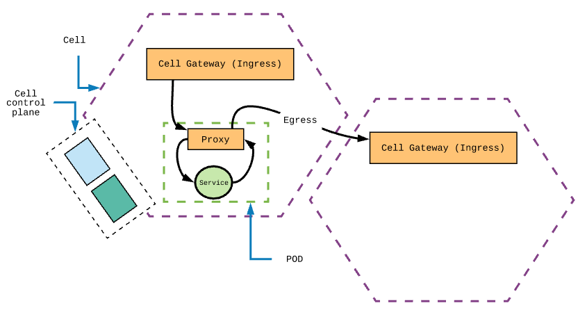
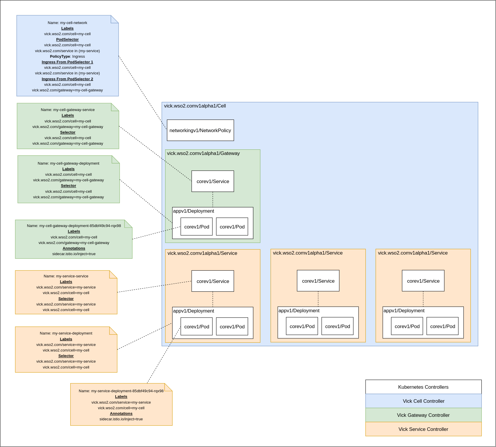

# Kubernetes VICK Resource

Following are the custom kubernetes resources that provides the cell based architecture for the VICK.

* **Cell** provides a basic isolation for you services. A single cell includes 
a cell gateway, cell control pane.

* **Service** is the smallest unit that you can deploy in to VICK. All of the 
services are deployed into a specific cell and can access only via the cell gateway. 

### CRD deployment inside the cluster

